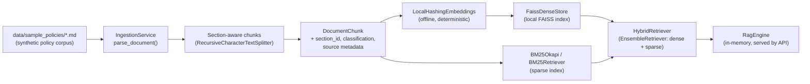
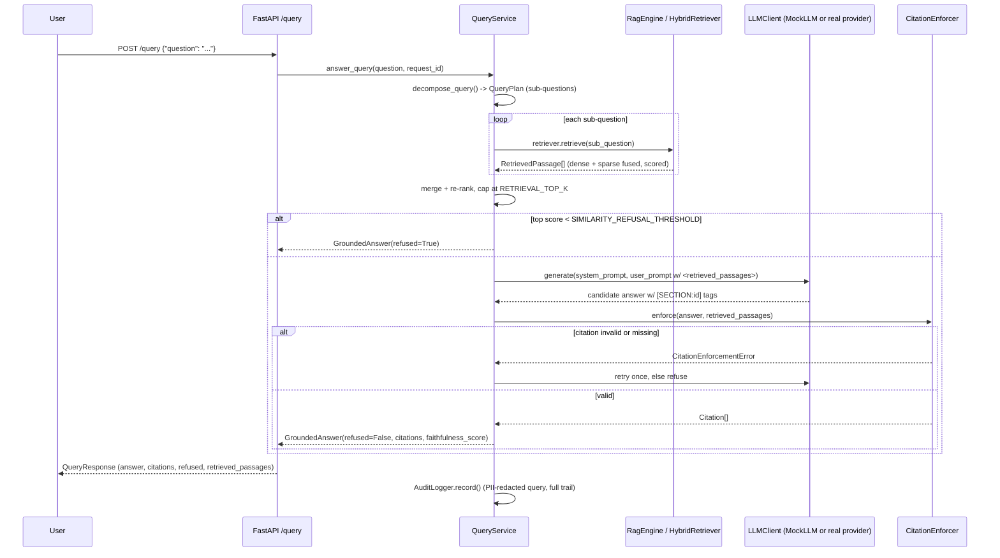

# Policy & Regulatory Research Copilot: A Self-Hosted LangChain RAG System for Financial Compliance Teams

> **Fictional demo, synthetic data only.** This project is a portfolio
> engineering demo. Every scenario, policy document, and data point in it
> references a wholly invented company, **"Northbridge Financial Group"**
> — invented solely to make this demo concrete. It is not a real bank, and
> nothing in this repository represents any real institution's actual
> policies, systems, or data. No real employer, past or present, is
> referenced anywhere in this codebase.

## Why This Exists

Compliance teams at financial institutions spend enormous effort manually
searching internal policy documents to answer questions like "what's our
enhanced due diligence threshold?" or "what SLA applies to a SEV-1
incident?" — questions with precise, citable answers buried across dozens
of policy PDFs. This project demonstrates a retrieval-augmented generation
system purpose-built for that job: it never answers from memory, always
cites its source down to the section, and explicitly refuses rather than
guesses when the corpus doesn't support an answer.

It's also a deliberate architectural counterpoint to the other repos in
this portfolio. Where several of those explore managed/hosted agent
platforms, this one asks: what does the *safer default* look like when
your source documents are the kind of content compliance and infosec teams
are nervous about sending anywhere?

## Why LangChain + a Fully Self-Hosted Vector Store

This is the key architectural decision in this repository, and it's worth
stating plainly: **retrieval and vector search here run entirely
in-process, on local disk, via FAISS — no document text, embedding, or
query ever leaves the machine running this service**, unless you
explicitly opt into a real hosted LLM provider (off by default; see
"Getting Started").

This is a deliberate choice, not a default I forgot to change:

- Many regulated financial institutions place hard restrictions on sending
  policy, customer-adjacent, or supervisory-examination text to
  third-party-hosted AI platforms — sometimes for contractual reasons
  (data processing agreements not in place), sometimes for regulatory
  ones, sometimes because the third-party risk review itself takes months.
  The sample **Third-Party Vendor Risk Policy** and **Data Classification
  Standard** in `data/sample_policies/` spell out exactly this kind of
  constraint, in illustrative form.
- A self-hosted, swappable-component retrieval stack (FAISS today,
  documented pgvector swap-in path for tomorrow — see "Key Design
  Decisions" below) means the *system architecture itself* satisfies a
  "data never leaves our boundary" control, rather than relying entirely
  on a vendor's contractual promises.
- **This is one valid choice, not a universal one.** A managed vector
  database or hosted agent platform can be the right call when the
  content genuinely isn't sensitive, when a team lacks the operational
  capacity to run infrastructure, or when a vendor's compliance
  attestations (SOC 2, FedRAMP, etc.) already clear an institution's bar.
  The point of this repo is to demonstrate that I can reason about *when*
  self-hosting is the safer default, implement it cleanly with LangChain's
  component abstractions, and document the tradeoff explicitly — not to
  claim self-hosting is always correct.

LangChain's role specifically: its `Embeddings` / `VectorStore` /
`Retriever` interfaces make the FAISS-today, pgvector-tomorrow swap a
one-class change (see `infrastructure/vectorstore/faiss_store.py`), and
its `EnsembleRetriever` gives a clean, tested way to fuse dense and sparse
retrieval without hand-rolling reciprocal rank fusion.

## Architecture

### Ingestion Pipeline



### Hybrid Retrieval + Query Planning (per request)



## Key Design Decisions

1. **FAISS + a hashed local embedding by default, not a downloaded neural
   model.** Using `sentence-transformers`/HuggingFace embeddings would
   require downloading model weights on first run — a network call, which
   would break this repo's "no external network calls needed" promise.
   `infrastructure/vectorstore/local_embeddings.py::LocalHashingEmbeddings`
   is a deterministic, offline, hashed bag-of-words embedding — good
   enough to meaningfully complement BM25 in the hybrid ensemble for this
   demo corpus, explicitly documented as a placeholder for a real semantic
   embedding model (`HuggingFaceEmbeddings`, `OpenAIEmbeddings`, etc.) in
   production, which is a one-line swap.

2. **MockLLM as the default generator, real providers opt-in only.** The
   whole pipeline — ingestion, hybrid retrieval, query decomposition,
   citation-grounded synthesis, refusal, citation enforcement — needs to
   be exercisable by a reviewer with zero signup and zero cost. MockLLM
   (`infrastructure/llm/mock_llm.py`) is a deterministic, extractive
   "generator" that still has to honor the same citation-tagging contract
   a real LLM would. Real providers (OpenAI, Anthropic) are wired in
   behind the same `LLMClient` interface and activate automatically the
   moment a matching API key env var is set — no code change required.

3. **Citation enforcement is a runtime check, not a prompt instruction.**
   Telling a model "always cite your sources" in a system prompt is not a
   guarantee. `service/guardrails.py::CitationEnforcer` actually parses
   every `[SECTION:...]` tag out of a candidate answer and verifies it
   against the retrieved passage set; an answer that fails this check
   never reaches the user. This is the difference between a governance
   *claim* and a governance *control*.

4. **Hybrid retrieval, not dense-only.** Compliance text is full of exact
   identifiers ("MRM-POL-001", "SEV-1", "EDD") that keyword/BM25 search
   nails reliably, while paraphrased natural-language questions need
   semantic similarity. `infrastructure/vectorstore/hybrid_retriever.py`
   fuses both via LangChain's `EnsembleRetriever`, with an explicit,
   inspectable combined score (not just RRF rank) so the refusal threshold
   has a real number to check against.

5. **Refusal is a first-class outcome, not an error.**
   `domain/models.py::GroundedAnswer.refused` is a boolean the API always
   returns — there is no separate "error" response shape for "I don't
   know." A tool that is *confidently* uncertain is safer than one that
   always produces an answer.

## Governance & Guardrails

Full detail in [`GOVERNANCE.md`](./GOVERNANCE.md) and
[`SECURITY.md`](./SECURITY.md). Summary:

- **Citation enforcement**: every answer's `[SECTION:...]` tags are
  checked against the actually-retrieved passage set; fabricated or
  missing citations cause a retry, then a refusal — never a pass-through.
- **Refusal behavior**: retrieval below `SIMILARITY_REFUSAL_THRESHOLD`
  triggers an explicit, honest refusal rather than a best-effort guess.
- **Prompt-injection resistance**: retrieved document text is placed only
  in the user turn, inside an explicit `<retrieved_passages>` delimiter,
  and the system prompt explicitly instructs the model to treat that
  block as inert reference data even if it contains something that looks
  like an instruction. Citation enforcement is the backstop if that
  instruction is ever ignored. See `service/query_service.py` module
  docstring for the full mechanism.
- **Faithfulness evaluation**: a lexical-overlap faithfulness score ships
  on every response and as a standalone CI-gateable harness
  (`scripts/run_faithfulness_eval.py`).
- **Audit logging**: every query/answer is appended to a local JSONL audit
  trail with PII redaction applied to the raw query first.

## Getting Started

Requires **Python 3.10, 3.11, or 3.12** (this repo pins `faiss-cpu`,
`numpy`, and `langchain` versions from mid-2024 for reproducibility; at
the time of writing, prebuilt `faiss-cpu` wheels are not yet published for
Python 3.13+ — use `pyenv`/`py -3.10` or similar if your default
interpreter is newer).

```bash
git clone <this-repo-url>
cd langchain-rag-compliance-assistant

python -m venv .venv
source .venv/bin/activate        # Windows: .venv\Scripts\activate

make install                     # pip install -r requirements-dev.txt && pip install -e .
cp .env.example .env             # defaults already work offline out of the box

make test                        # 21 tests, fully offline, no API keys
python scripts/run_faithfulness_eval.py   # standalone faithfulness harness

make run                         # uvicorn on http://localhost:8000
```

Then, in another terminal:

```bash
curl http://localhost:8000/healthz
curl http://localhost:8000/readyz
curl http://localhost:8000/corpus

curl -X POST http://localhost:8000/query \
  -H "Content-Type: application/json" \
  -d '{"question": "What is required for enhanced due diligence on high risk customers?"}'

curl -X POST http://localhost:8000/reindex
```

Interactive API docs (Swagger UI) are available at
`http://localhost:8000/docs` once the server is running.

### Optional: Real LLM Providers

The default `LLM_PROVIDER=mock` requires no signup and makes no network
calls. To use a real provider instead:

```bash
pip install openai            # or: pip install anthropic
# in .env:
#   LLM_PROVIDER=openai
#   OPENAI_API_KEY=sk-...
make run
```

If `LLM_PROVIDER` is set but the matching API key is empty, the app logs a
warning and transparently falls back to MockLLM rather than failing to
start — see `infrastructure/llm/provider_factory.py`.

### Running with Docker

```bash
docker compose up --build
curl http://localhost:8000/healthz
```

## Production Deployment

- **Docker**: `Dockerfile` is a pinned, multi-stage build producing a
  minimal non-root runtime image (see `docker-compose.yml` for one-command
  local spin-up).
- **Kubernetes**: manifests under `deploy/k8s/` — `Deployment` (non-root,
  no privilege escalation, all capabilities dropped, liveness/readiness
  probes wired to `/healthz` and `/readyz`), `Service`, `ConfigMap`,
  `Secret` template, and a `HorizontalPodAutoscaler` (CPU + memory,
  2–8 replicas).
- **OpenShift**: see [`deploy/OPENSHIFT.md`](./deploy/OPENSHIFT.md) for
  the small set of adjustments (arbitrary UID compatibility, Routes,
  SCC notes) needed on top of the plain Kubernetes manifests.
- **CI**: `.github/workflows/ci.yml` runs `ruff`, `mypy`, `pytest` (with
  coverage), the offline faithfulness eval harness, and a Docker build +
  container smoke test (`/healthz`, `/readyz`) on every push/PR.

### Observability

`infrastructure/observability/tracing.py` configures an OpenTelemetry
`TracerProvider` with spans around ingestion, retrieval, generation, and
citation enforcement (`service/query_service.py`,
`service/rag_engine.py`). By default it exports to the console
(`ConsoleSpanExporter`) so the demo has zero external dependencies; in a
real deployment, swap in `OTLPSpanExporter` pointed at your collector
(Tempo, Jaeger, Honeycomb, etc.) — the span structure doesn't need to
change. Structured JSON logs (`infrastructure/logging_setup.py`) carry a
correlation/request ID on every line and are directly ingestible by
Loki/ELK/Splunk-style log aggregation.

For a Prometheus/Grafana setup: front the app with the `prometheus-fastapi-
instrumentator` package (not included, to keep the base install minimal)
to expose a `/metrics` endpoint, or scrape the OTLP metrics pipeline if
your collector supports the OTel metrics SDK alongside the tracing SDK
already wired in here. Dashboard candidates: request latency by route,
refusal rate over time (a leading indicator of corpus drift or threshold
miscalibration), and citation-enforcement rejection rate.

## Tech Stack

| Layer | Technology | Why |
|---|---|---|
| API | FastAPI + Uvicorn | Async, typed, auto-generated OpenAPI docs |
| Validation | Pydantic v2 / pydantic-settings | Boundary validation + typed env config |
| RAG orchestration | LangChain (core, community, text-splitters) | `Embeddings`/`VectorStore`/`Retriever` abstractions make components swappable |
| Dense vector store | FAISS (`faiss-cpu`), local/in-process | No data leaves the host; see "Why LangChain + a self-hosted vector store" |
| Sparse retrieval | `rank_bm25` via LangChain's `BM25Retriever` | Reliable exact/keyword matching for policy IDs and acronyms |
| Hybrid fusion | LangChain `EnsembleRetriever` | Combines dense + sparse ranked lists |
| Default LLM | MockLLM (custom, offline, deterministic) | Zero-cost, zero-network, fully reviewable demo |
| Optional LLM | OpenAI / Anthropic (lazy-imported, opt-in) | Real-provider mode without a hard dependency |
| Resilience | `tenacity` (retry + backoff/jitter), custom circuit breaker | Bounded, well-behaved failure handling on external calls |
| Logging | `python-json-logger` | Structured JSON logs with correlation IDs |
| Tracing | OpenTelemetry SDK | Spans around retrieval/generation, OTLP-exporter-ready |
| Testing | `pytest`, `pytest-cov`, `httpx` (via FastAPI `TestClient`) | Unit + integration coverage, offline |
| Lint/Types | `ruff`, `mypy` | Fast lint + static typing gate in CI |
| Packaging | `pip` + `pyproject.toml` (setuptools) | Standard, no exotic build tooling |
| Containerization | Docker (multi-stage, non-root), `docker-compose` | One-command local spin-up, minimal prod image |
| Orchestration | Kubernetes manifests, OpenShift notes | Deployment/Service/ConfigMap/Secret/HPA |

## Repository Structure

```
langchain-rag-compliance-assistant/
├── data/
│   └── sample_policies/            # 8 synthetic policy docs (Northbridge Financial Group)
├── deploy/
│   ├── k8s/                        # Deployment, Service, ConfigMap, Secret template, HPA
│   └── OPENSHIFT.md
├── scripts/
│   ├── build_index.py              # standalone reindex CLI
│   └── run_faithfulness_eval.py    # offline faithfulness eval harness (CI-gateable)
├── src/compliance_copilot/
│   ├── api/                        # FastAPI boundary: schemas, routes, deps, main (lifespan, /healthz, /readyz)
│   ├── service/                    # orchestration: ingestion_service, rag_engine, query_service, guardrails
│   ├── domain/                     # framework-agnostic models + exceptions
│   └── infrastructure/
│       ├── llm/                    # LLMClient interface, MockLLM, real providers, circuit breaker, factory
│       ├── vectorstore/            # FAISS store, local hashing embeddings, hybrid (dense+sparse) retriever
│       ├── observability/          # OpenTelemetry tracing setup
│       ├── security/                # PII redaction
│       ├── config.py                # pydantic-settings (single source of env config)
│       └── logging_setup.py         # structured JSON logging + correlation IDs
├── tests/                          # ingestion, retrieval, refusal, citation enforcement, API integration
├── .github/workflows/ci.yml        # lint, typecheck, test, offline eval, docker build+smoke-test
├── Dockerfile                      # multi-stage, non-root, pinned base image
├── docker-compose.yml
├── Makefile                        # install / test / lint / typecheck / run
├── GOVERNANCE.md
├── SECURITY.md
├── CONTRIBUTING.md
└── .env.example
```

## Roadmap / What I'd Build Next

- **pgvector adapter**: implement a second `VectorStore` adapter behind
  the same interface as `FaissDenseStore` for multi-replica deployments
  that need a shared index instead of a per-pod local file.
- **Real semantic embeddings as the default**, with an explicit,
  documented one-time model-download step (still opt-in, to preserve the
  zero-network default demo path).
- **Per-user classification-tier entitlement enforcement** at the
  retrieval layer, completing the access-control story the sample Data
  Classification Standard describes (currently, classification metadata is
  tracked but not yet used to filter retrieval by requester entitlement).
- **NLI-based faithfulness scoring** to replace/augment the current
  lexical-overlap proxy with a proper entailment check or LLM-as-judge
  harness.
- **Multi-agent extension**: a second agent role (e.g. a "policy gap
  reviewer") that consumes this system's grounded answers as a tool,
  demonstrating orchestration across multiple specialized agents rather
  than a single RAG loop — a natural bridge to the multi-agent
  orchestration patterns explored elsewhere in this portfolio.
- **Prometheus `/metrics` endpoint** wired directly into the app (kept out
  of the base install here to preserve a minimal dependency footprint).
